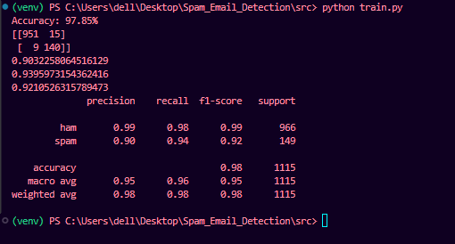

## Spam Email Detection using Naive Bayes

##  Project Overview

This project is a Machine Learning based Spam Email Detection System built using the Multinomial Naive Bayes algorithm. The model classifies an email as Spam or Ham (Not Spam) after preprocessing the text and converting it into numerical features using CountVectorizer.

This project was built to understand the complete Machine Learning workflow, including data preprocessing, feature engineering, model training, evaluation, model saving, and prediction.

##  Features

* Text preprocessing

  1.Convert text to lowercase
  2.Remove punctuation
  3.Remove English stopwords (NLTK)
  4.Apply Porter Stemming

Feature extraction using CountVectorizer
Spam classification using Multinomial Naive Bayes
Evaluation using:

  1. Accuracy
  2. Confusion Matrix
  3. Precision
  4. Recall
  5. F1 Score
  6. Classification Report
Save trained model using Joblib
Predict spam/ham for new emails from the terminal

##  Project Structure

Spam_Email_Detection/
│
├── data/
│   └── email.csv
│
├── models/
│   ├── spam_model.joblib
│   └── vectorizer.joblib
│
├── notebooks/
│   └── Spam_Email_Detection.ipynb
│
├── src/
│   ├── __init__.py
│   ├── preprocess.py
│   ├── train.py
│   └── predict.py
│
├── requirements.txt
├── README.md
└── .gitignore

##  Technologies Used

* Python
* Pandas
* Scikit-learn
* NLTK
* Joblib
* Matplotlib

##  Installation

## Clone the repository:
bash
git clone <repository-url>

## Move into the project directory:
bash
cd Spam_Email_Detection

## Install the required libraries:

bash
pip install -r requirements.txt

Download NLTK stopwords (only once):

python
import nltk
nltk.download("stopwords")

##  Train the Model

Move into the 'src' directory:
bash
cd src

## Run:
bash
python train.py

## This will:

1. Read the dataset
2. Preprocess all emails
3. Train the Naive Bayes model
4. Evaluate the model
5. Save the trained model and vectorizer

##  Predict a New Email

Run:

bash
python predict.py

Example:

Enter your email:
Congratulations! You have won ₹50,000. Click the link below.

Prediction:
SPAM

##  Model Performance

Current Model Performance:

1. Accuracy: 97.85%
2. Precision (Spam): 90.32%
3. Recall (Spam): 93.96%
4. F1 Score (Spam): 92.11%

##  What I Learned

Through this project I learned:

1. Data preprocessing
2. Feature engineering
3. Text vectorization
4. CountVectorizer
5. Multinomial Naive Bayes
6. Train/Test Split
7. Model evaluation metrics
8. Saving and loading ML models
9. Building a simple end-to-end Machine Learning application

##  Future Improvements

1. Use TF-IDF Vectorizer
2. Compare multiple Machine Learning algorithms
3. Build a Flask/FastAPI web application
4. Improve preprocessing using lemmatization
5. Deploy the model online

##  Author
Manish Saini

AIML Student | Learning Machine Learning, Deep Learning and LLM Engineering.
